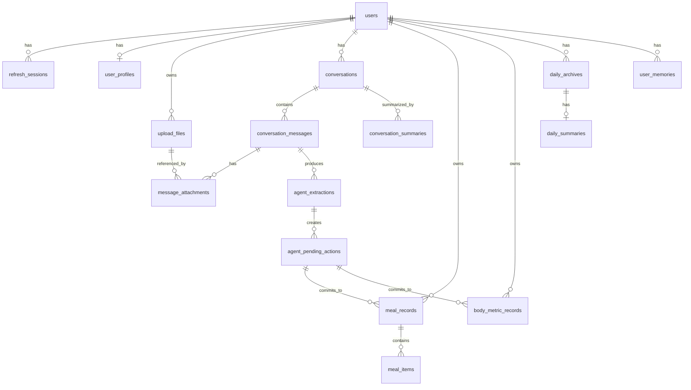

# LetMeFit V1 数据库表设计

- 文档状态：V1 初稿
- 版本：0.1
- 更新时间：2026-05-01
- 数据库：MySQL 8.4 LTS

## 1. 设计原则

V1 数据库支撑以下闭环：

```text
短信登录 -> 创建档案 -> 对话记录 -> AI 生成候选动作 -> 后端规则判定/用户确认 -> 正式记录 -> 每日归档 -> 总结建议
```

统一约定：

- 表名使用复数 snake_case
- 主键使用 `VARCHAR(40)`，由后端生成带前缀 ID，例如 `user_...`、`meal_...`
- 时间字段使用 UTC `DATETIME(6)`
- 用户本地日期单独存 `DATE` 字段，默认时区为 `Asia/Shanghai`
- 体重、营养、置信度等数值使用 `DECIMAL`，不用 float
- 枚举字段使用 `VARCHAR(32)`，由后端 Pydantic 和业务层校验
- 用户私有表必须包含 `user_id`
- refresh token、手机号审计日志 IP 等敏感值只保存 hash 或脱敏值
- 餐食、身体指标、文件默认软删除，使用 `deleted_at`
- AI 提取结果不能由模型直接写入正式记录。模型输出先进入 `agent_extractions` 作为候选动作；明确、低歧义且通过后端规则校验的动作可自动写入正式记录，其余动作必须进入 `agent_pending_actions`

## 2. 认证与用户

### 2.1 `users`

用户账号表。

| 字段 | 类型 | 说明 |
|---|---|---|
| `id` | `VARCHAR(40)` PK | `user_...` |
| `phone_number` | `VARCHAR(32)` UNIQUE | E.164 格式，如 `+8613800000000` |
| `country_code` | `VARCHAR(8)` | 默认 `86` |
| `phone_verified_at` | `DATETIME(6)` NULL | 手机号验证时间 |
| `status` | `VARCHAR(32)` | `active` / `disabled` / `deleted` |
| `last_login_at` | `DATETIME(6)` NULL | 最近登录时间 |
| `created_at` | `DATETIME(6)` | 创建时间 |
| `updated_at` | `DATETIME(6)` | 更新时间 |

索引：

- `uq_users_phone_number`
- `ix_users_status`

### 2.2 `refresh_sessions`

服务端可撤销登录态。数据库只保存 refresh token hash，不保存明文 token。

| 字段 | 类型 | 说明 |
|---|---|---|
| `id` | `VARCHAR(40)` PK | `sess_...` |
| `user_id` | `VARCHAR(40)` FK | 关联 `users.id` |
| `refresh_token_hash` | `VARCHAR(128)` UNIQUE | refresh token 哈希 |
| `expires_at` | `DATETIME(6)` | 过期时间 |
| `revoked_at` | `DATETIME(6)` NULL | 退出登录或撤销时间 |
| `created_ip_hash` | `VARCHAR(128)` NULL | IP 哈希 |
| `user_agent` | `VARCHAR(512)` NULL | 客户端 UA |
| `created_at` | `DATETIME(6)` | 创建时间 |
| `updated_at` | `DATETIME(6)` | 更新时间 |

索引：

- `ix_refresh_sessions_user_id`
- `ix_refresh_sessions_expires_at`
- `ix_refresh_sessions_revoked_at`

### 2.3 `sms_verification_events`

短信发送和校验事件日志。验证码由阿里云生成和校验，本表不保存验证码明文，也不保存验证码 hash。

| 字段 | 类型 | 说明 |
|---|---|---|
| `id` | `VARCHAR(40)` PK | `sms_evt_...` |
| `phone_number_hash` | `VARCHAR(128)` | 手机号哈希 |
| `country_code` | `VARCHAR(8)` | 默认 `86` |
| `purpose` | `VARCHAR(32)` | `login` |
| `event_type` | `VARCHAR(32)` | `send` / `check` |
| `provider` | `VARCHAR(32)` | `aliyun_dypnsapi` |
| `provider_request_id` | `VARCHAR(128)` NULL | 阿里云 RequestId |
| `success` | `BOOLEAN` | 是否成功 |
| `result_code` | `VARCHAR(64)` NULL | 阿里云返回码或内部错误码 |
| `ip_hash` | `VARCHAR(128)` NULL | 请求 IP 哈希 |
| `created_at` | `DATETIME(6)` | 创建时间 |

索引：

- `ix_sms_events_phone_created`
- `ix_sms_events_created_at`

### 2.4 `user_profiles`

用户健身档案，一名用户最多一条。

| 字段 | 类型 | 说明 |
|---|---|---|
| `id` | `VARCHAR(40)` PK | `prof_...` |
| `user_id` | `VARCHAR(40)` UNIQUE FK | 关联 `users.id` |
| `age` | `SMALLINT` NULL | 年龄 |
| `sex` | `VARCHAR(32)` NULL | `male` / `female` / `other` / `unknown` |
| `height_cm` | `DECIMAL(5,2)` NULL | 身高 |
| `current_weight_kg` | `DECIMAL(6,2)` NULL | 当前体重 |
| `target_weight_kg` | `DECIMAL(6,2)` NULL | 目标体重 |
| `activity_level` | `VARCHAR(32)` NULL | `low` / `moderate` / `high` |
| `goal_type` | `VARCHAR(32)` NULL | `fat_loss` / `maintain` / `muscle_gain` |
| `completed_at` | `DATETIME(6)` NULL | 档案完成时间 |
| `created_at` | `DATETIME(6)` | 创建时间 |
| `updated_at` | `DATETIME(6)` | 更新时间 |

## 3. 媒体与会话

### 3.1 `upload_files`

用户上传或本地保留的媒体引用。V1 支持三种策略：

- `client_local`：成本敏感测试阶段，原始图片/音频只留在 App 本地
- `local_server`：本地开发或单机测试，文件存服务端磁盘
- `cos` / `oss` / `s3`：公开测试或生产对象存储

| 字段 | 类型 | 说明 |
|---|---|---|
| `id` | `VARCHAR(40)` PK | `file_...` |
| `user_id` | `VARCHAR(40)` FK | 文件所属用户 |
| `storage_provider` | `VARCHAR(32)` | `client_local` / `local_server` / `cos` / `oss` / `s3` |
| `client_local_ref` | `VARCHAR(256)` NULL | App 本地资源引用 |
| `bucket` | `VARCHAR(128)` NULL | 对象存储 bucket |
| `object_key` | `VARCHAR(512)` NULL | 服务端公网媒体 URL 或对象存储 key |
| `mime_type` | `VARCHAR(128)` | 文件类型 |
| `size_bytes` | `BIGINT` NULL | 文件大小 |
| `source` | `VARCHAR(32)` | `camera` / `album` / `microphone` / `upload` |
| `retention_policy` | `VARCHAR(32)` | `transient` / `retained` |
| `status` | `VARCHAR(32)` | `pending` / `ready` / `uploaded` / `local_only` / `failed` / `deleted` |
| `created_at` | `DATETIME(6)` | 创建时间 |
| `deleted_at` | `DATETIME(6)` NULL | 删除时间 |

索引：

- `ix_upload_files_user_created`
- `ix_upload_files_status`

注意：

- `client_local` 文件不能被后端长期重放识别；如需重新识别，客户端必须再次临时上传或发送原始文件。
- `local_server` 语音文件用于测试阶段临时识别，`object_key` 应是 ASR 服务可访问的公网 HTTP/HTTPS URL。
- 正式记录不能依赖本地图片存在，必须保存结构化字段。

### 3.2 `conversations`

Agent 会话。

| 字段 | 类型 | 说明 |
|---|---|---|
| `id` | `VARCHAR(40)` PK | `conv_...` |
| `user_id` | `VARCHAR(40)` FK | 用户 |
| `title` | `VARCHAR(128)` NULL | 会话标题 |
| `status` | `VARCHAR(32)` | `active` / `archived` |
| `created_at` | `DATETIME(6)` | 创建时间 |
| `updated_at` | `DATETIME(6)` | 更新时间 |

索引：

- `ix_conversations_user_updated`

### 3.3 `conversation_messages`

会话消息。消息内容使用 JSON 存储，支持 text、image、audio 等 part。

| 字段 | 类型 | 说明 |
|---|---|---|
| `id` | `VARCHAR(40)` PK | `msg_...` |
| `conversation_id` | `VARCHAR(40)` FK | 会话 |
| `user_id` | `VARCHAR(40)` FK | 冗余 user_id，便于隔离查询 |
| `role` | `VARCHAR(32)` | `user` / `assistant` / `system` |
| `content_json` | `JSON` | 原始消息内容 |
| `intent` | `VARCHAR(64)` NULL | 识别意图 |
| `requires_review` | `BOOLEAN` | 是否产生待确认动作 |
| `created_at` | `DATETIME(6)` | 创建时间 |

索引：

- `ix_messages_conversation_created`
- `ix_messages_user_created`

### 3.4 `message_attachments`

消息与媒体文件的关联表。

| 字段 | 类型 | 说明 |
|---|---|---|
| `id` | `VARCHAR(40)` PK | `ma_...` |
| `message_id` | `VARCHAR(40)` FK | 消息 |
| `file_id` | `VARCHAR(40)` FK | 上传文件或本地文件引用 |
| `created_at` | `DATETIME(6)` | 创建时间 |

唯一约束：

- `uq_message_attachments_message_file`

### 3.5 `conversation_summaries`

会话压缩摘要。用于 LLM 上下文管理，不作为正式事实来源。

| 字段 | 类型 | 说明 |
|---|---|---|
| `id` | `VARCHAR(40)` PK | `conv_sum_...` |
| `conversation_id` | `VARCHAR(40)` FK | 会话 |
| `user_id` | `VARCHAR(40)` FK | 用户 |
| `from_message_id` | `VARCHAR(40)` FK | 摘要起始消息 |
| `to_message_id` | `VARCHAR(40)` FK | 摘要结束消息 |
| `summary_text` | `TEXT` | 摘要内容 |
| `token_estimate` | `INT` NULL | 估算 token 数 |
| `created_at` | `DATETIME(6)` | 创建时间 |

索引：

- `ix_conversation_summaries_conversation_created`

## 4. AI 提取与待确认动作

### 4.1 `agent_extractions`

AI 原始提取结果。用于审计、调试和生成候选动作，不直接等同于正式记录。后端规则会决定候选动作是自动写入正式记录，还是进入待确认动作。

| 字段 | 类型 | 说明 |
|---|---|---|
| `id` | `VARCHAR(40)` PK | `ext_...` |
| `user_id` | `VARCHAR(40)` FK | 用户 |
| `conversation_id` | `VARCHAR(40)` NULL FK | 来源会话 |
| `message_id` | `VARCHAR(40)` NULL FK | 来源消息 |
| `input_types_json` | `JSON` | `["text","image"]` |
| `intent` | `VARCHAR(64)` | `create_meal_record` 等 |
| `confidence` | `DECIMAL(5,4)` NULL | 总置信度 |
| `requires_confirmation` | `BOOLEAN` | 是否需要确认 |
| `raw_output_json` | `JSON` NULL | 模型原始结构化输出 |
| `warnings_json` | `JSON` NULL | 低置信字段等 |
| `status` | `VARCHAR(32)` | `succeeded` / `failed` |
| `created_at` | `DATETIME(6)` | 创建时间 |

索引：

- `ix_agent_extractions_user_created`
- `ix_agent_extractions_message`

### 4.2 `agent_pending_actions`

对话中的待确认动作。它是 Review/Edit 确认卡片的数据来源。只有需要用户确认、修改或补充的信息才会进入此表；已被后端规则自动保存的明确记录不会产生 pending action。

| 字段 | 类型 | 说明 |
|---|---|---|
| `id` | `VARCHAR(40)` PK | `pa_...` |
| `user_id` | `VARCHAR(40)` FK | 用户 |
| `conversation_id` | `VARCHAR(40)` FK | 会话 |
| `source_message_id` | `VARCHAR(40)` FK | 触发动作的消息 |
| `extraction_id` | `VARCHAR(40)` NULL FK | 来源 AI 提取 |
| `action_type` | `VARCHAR(64)` | `create_meal_record` / `create_body_metric_record` / `generate_daily_summary` |
| `status` | `VARCHAR(32)` | `needs_clarification` / `pending_confirmation` / `confirmed` / `discarded` / `committed` / `expired` |
| `draft_payload_json` | `JSON` | 用户可编辑草稿 |
| `warnings_json` | `JSON` NULL | 待确认字段、低置信原因 |
| `confidence` | `DECIMAL(5,4)` NULL | 置信度 |
| `confirmed_at` | `DATETIME(6)` NULL | 用户确认时间 |
| `committed_record_type` | `VARCHAR(32)` NULL | `meal` / `body_metric` / `summary` |
| `committed_record_id` | `VARCHAR(40)` NULL | 正式记录 ID |
| `expires_at` | `DATETIME(6)` NULL | 过期时间 |
| `created_at` | `DATETIME(6)` | 创建时间 |
| `updated_at` | `DATETIME(6)` | 更新时间 |

索引：

- `ix_pending_actions_user_status`
- `ix_pending_actions_conversation_status`
- `ix_pending_actions_expires_at`

规则：

- `pending_confirmation` 可以被确认、修改或放弃。
- `needs_clarification` 表示字段不足或冲突，需要继续追问。
- `committed` 后必须写入 `committed_record_type` 和 `committed_record_id`。
- 正式记录写入失败时，不能把状态改成 `committed`。

## 5. 正式记录

### 5.1 `meal_records`

餐食记录主表。

| 字段 | 类型 | 说明 |
|---|---|---|
| `id` | `VARCHAR(40)` PK | `meal_...` |
| `user_id` | `VARCHAR(40)` FK | 用户 |
| `recorded_at` | `DATETIME(6)` | UTC 记录时间 |
| `recorded_tz` | `VARCHAR(64)` | 默认 `Asia/Shanghai` |
| `local_date` | `DATE` | 用户本地日期 |
| `source_type` | `VARCHAR(32)` | `photo` / `voice` / `text` / `manual` / `mixed` |
| `meal_type` | `VARCHAR(32)` | `breakfast` / `lunch` / `dinner` / `snack` / `unknown` |
| `total_calories` | `DECIMAL(8,2)` NULL | 总热量 |
| `total_protein_g` | `DECIMAL(8,2)` NULL | 蛋白质 |
| `total_carbs_g` | `DECIMAL(8,2)` NULL | 碳水 |
| `total_fat_g` | `DECIMAL(8,2)` NULL | 脂肪 |
| `confidence` | `DECIMAL(5,4)` NULL | 整体置信度 |
| `source_pending_action_id` | `VARCHAR(40)` NULL FK | 来源待确认动作 |
| `notes` | `TEXT` NULL | 用户备注 |
| `created_at` | `DATETIME(6)` | 创建时间 |
| `updated_at` | `DATETIME(6)` | 更新时间 |
| `deleted_at` | `DATETIME(6)` NULL | 软删除 |

索引：

- `ix_meal_records_user_date`
- `ix_meal_records_user_recorded_at`

### 5.2 `meal_items`

餐食明细。

| 字段 | 类型 | 说明 |
|---|---|---|
| `id` | `VARCHAR(40)` PK | `mi_...` |
| `meal_record_id` | `VARCHAR(40)` FK | 餐食记录 |
| `display_order` | `SMALLINT` | 展示顺序 |
| `name` | `VARCHAR(128)` | 食物名称 |
| `alias` | `VARCHAR(128)` NULL | 用户表达或别名 |
| `portion_text` | `VARCHAR(128)` NULL | “约120g” |
| `portion_grams` | `DECIMAL(8,2)` NULL | 克重 |
| `calories` | `DECIMAL(8,2)` NULL | 热量 |
| `protein_g` | `DECIMAL(8,2)` NULL | 蛋白质 |
| `carbs_g` | `DECIMAL(8,2)` NULL | 碳水 |
| `fat_g` | `DECIMAL(8,2)` NULL | 脂肪 |
| `confidence` | `DECIMAL(5,4)` NULL | 单项置信度 |
| `user_corrected` | `BOOLEAN` | 是否被用户修正 |
| `created_at` | `DATETIME(6)` | 创建时间 |
| `updated_at` | `DATETIME(6)` | 更新时间 |

### 5.3 `body_metric_records`

身体指标记录。

| 字段 | 类型 | 说明 |
|---|---|---|
| `id` | `VARCHAR(40)` PK | `bm_...` |
| `user_id` | `VARCHAR(40)` FK | 用户 |
| `recorded_at` | `DATETIME(6)` | UTC 记录时间 |
| `recorded_tz` | `VARCHAR(64)` | 默认 `Asia/Shanghai` |
| `local_date` | `DATE` | 用户本地日期 |
| `source_type` | `VARCHAR(32)` | `scale_photo` / `voice` / `text` / `manual` |
| `weight_kg` | `DECIMAL(6,2)` NULL | 体重 |
| `body_fat_percentage` | `DECIMAL(5,2)` NULL | 体脂率 |
| `bmi` | `DECIMAL(5,2)` NULL | BMI |
| `muscle_mass_kg` | `DECIMAL(6,2)` NULL | 肌肉量 |
| `water_percentage` | `DECIMAL(5,2)` NULL | 水分率 |
| `confidence` | `DECIMAL(5,4)` NULL | 置信度 |
| `source_pending_action_id` | `VARCHAR(40)` NULL FK | 来源待确认动作 |
| `created_at` | `DATETIME(6)` | 创建时间 |
| `updated_at` | `DATETIME(6)` | 更新时间 |
| `deleted_at` | `DATETIME(6)` NULL | 软删除 |

索引：

- `ix_body_metrics_user_date`
- `ix_body_metrics_user_recorded_at`

## 6. 归档、总结与记忆

### 6.1 `daily_archives`

每日归档缓存表。可以由餐食和身体指标正式记录重新计算。

| 字段 | 类型 | 说明 |
|---|---|---|
| `id` | `VARCHAR(40)` PK | `archive_...` |
| `user_id` | `VARCHAR(40)` FK | 用户 |
| `archive_date` | `DATE` | 本地日期 |
| `timezone` | `VARCHAR(64)` | 默认 `Asia/Shanghai` |
| `meal_count` | `INT` | 餐食记录数 |
| `body_metric_count` | `INT` | 身体指标记录数 |
| `calorie_total` | `DECIMAL(8,2)` NULL | 总热量 |
| `protein_total_g` | `DECIMAL(8,2)` NULL | 蛋白质 |
| `carbs_total_g` | `DECIMAL(8,2)` NULL | 碳水 |
| `fat_total_g` | `DECIMAL(8,2)` NULL | 脂肪 |
| `completeness_score` | `DECIMAL(5,4)` NULL | 完整度 |
| `last_calculated_at` | `DATETIME(6)` | 最近计算时间 |
| `created_at` | `DATETIME(6)` | 创建时间 |
| `updated_at` | `DATETIME(6)` | 更新时间 |

唯一约束：

- `uq_daily_archives_user_date`

### 6.2 `daily_summaries`

每日总结和建议。

| 字段 | 类型 | 说明 |
|---|---|---|
| `id` | `VARCHAR(40)` PK | `summary_...` |
| `user_id` | `VARCHAR(40)` FK | 用户 |
| `archive_id` | `VARCHAR(40)` NULL FK | 对应归档 |
| `summary_date` | `DATE` | 本地日期 |
| `summary_text` | `TEXT` | 总结 |
| `suggestions_json` | `JSON` | 1-3 条建议 |
| `model_provider` | `VARCHAR(64)` NULL | 模型供应商 |
| `model_name` | `VARCHAR(128)` NULL | 模型名称 |
| `generation_status` | `VARCHAR(32)` | `generated` / `failed` |
| `created_at` | `DATETIME(6)` | 创建时间 |
| `updated_at` | `DATETIME(6)` | 更新时间 |

唯一约束：

- `uq_daily_summaries_user_date`

### 6.3 `user_memories`

用户纠错记忆，用于后续提升个体化识别。

| 字段 | 类型 | 说明 |
|---|---|---|
| `id` | `VARCHAR(40)` PK | `mem_...` |
| `user_id` | `VARCHAR(40)` FK | 用户 |
| `memory_type` | `VARCHAR(32)` | `food_alias` / `portion_preference` / `scale_correction` / `phrase_mapping` |
| `memory_key` | `VARCHAR(128)` | 记忆 key |
| `memory_value_json` | `JSON` | 记忆内容 |
| `confidence` | `DECIMAL(5,4)` | 可信度 |
| `observation_count` | `INT` | 观察次数 |
| `last_seen_at` | `DATETIME(6)` | 最近出现时间 |
| `created_at` | `DATETIME(6)` | 创建时间 |
| `updated_at` | `DATETIME(6)` | 更新时间 |

索引：

- `ix_user_memories_user_type_key`

## 7. 关系图



## 8. 上下文管理

数据库保存原始消息，但模型调用上下文由后端临时组装：

```text
当前消息
+ 当前 pending_action
+ 最近若干条原始消息
+ conversation_summaries 滚动摘要
+ user_profiles 长期档案
+ 今日 meal_records / body_metric_records
+ 相关 user_memories
+ 安全边界和输出 schema
= 本次 LLM 上下文
```

规则：

- 原始消息保留用于 UI 展示、审计和排障。
- 较早消息压缩到 `conversation_summaries`，减少模型调用成本。
- 待确认动作不能被摘要替代或丢失。
- 摘要不是正式事实来源；正式事实只来自档案、餐食、身体指标、每日归档等结构化表。

## 9. 迁移落地顺序

1. 认证与档案：`users`、`refresh_sessions`、`sms_verification_events`、`user_profiles`
2. 媒体与会话：`upload_files`、`conversations`、`conversation_messages`、`message_attachments`、`conversation_summaries`
3. AI 状态：`agent_extractions`、`agent_pending_actions`
4. 正式记录：`meal_records`、`meal_items`、`body_metric_records`
5. 归档与记忆：`daily_archives`、`daily_summaries`、`user_memories`
